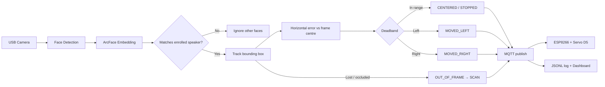

# AI-Powered Single-Speaker Face Recognition & Camera Tracking System

**BENAX Technologies Ltd** — integrated assessment project combining machine learning, computer vision, networking, embedded systems, and motor control.

Unlike conventional face tracking that follows any detected face, this system **locks onto one pre-enrolled speaker identity** and continues tracking that individual even when other faces appear (audience, assistants, co-presenters).

Runs on **Windows + Python 3.10+** (tested on 3.12).

## System overview

| Layer | Role |
|-------|------|
| **PC (Python)** | Camera capture, face detection, single-identity recognition, tracking, MQTT command generation |
| **MQTT / Wi-Fi** | Continuous motor commands to the embedded controller |
| **ESP8266** | MQTT subscriber → servo PWM on **D5 (GPIO14)** |
| **Servo + mount** | Horizontal camera pan to keep the speaker centred |

### Assessment features

- **Face enrollment** — 10–30 images → single ArcFace embedding template (`python -m src.enroll`)
- **Speaker lock** — recognise only the enrolled speaker; ignore all other faces
- **Tracking & motor control** — horizontal error → `MOVED_LEFT`, `MOVED_RIGHT`, `CENTERED`, `STOPPED`, `OUT_OF_FRAME`, `SCAN`
- **Re-acquisition** — `SCAN` sweep when the speaker is occluded or leaves the frame
- **Evidence logging** — speaker ID, confidence, timestamps, motor commands → `data/history/history_log.jsonl`
- **Live HTML dashboard** *(innovation)* — real-time lock status, confidence, motor commands, and event log in the browser

### Recognise → Track → Command pipeline



Pipeline detail: **Camera → FaceMesh → align 112×112 → ArcFace embedding → speaker match → horizontal tracking error → MQTT motor command**

### Assessment activity mapping

| Assessment activity | Implementation |
|---------------------|----------------|
| **a) Speaker face enrollment** (10–30 images, embedding template) | `python -m src.enroll` → `data/enroll/`, `data/db/face_db.npz` |
| **b) Single-identity recognition (speaker lock)** | `faceLockServo.py` — match enrolled speaker only; other faces drawn but ignored for motor control |
| **c) Face tracking & command generation** | `motion_control.py` — horizontal error → `MOVED_LEFT` / `MOVED_RIGHT` / `CENTERED` + deadband smoothing |
| **d) MQTT embedded motor control** | `faceLockServo.py` (paho-mqtt publisher) + `servo_controller.ino` (ESP8266 subscriber, **D5 / GPIO14**) |
| **e) Validation & evidence logging** | `history_manager.py` → `data/history/history_log.jsonl` (speaker ID, confidence, timestamp, motor command) |
| **Re-acquisition (occlusion)** | `OUT_OF_FRAME` logged → `SCAN` sweep until same enrolled speaker re-appears |
| **Live dashboard (innovation)** | `python -m src.dashboard` — browser view of lock status and event log |

---

## 📁 Project Structure

```
Facelocking2/
│
├── .venv/
├── dashboard/
│   └── index.html               # Live event dashboard (served by dashboard.py)
├── data/
│   ├── db/
│   │   ├── face_db.npz          # Enrolled face embeddings
│   │   └── face_db.json         # DB metadata
│   ├── enroll/                  # Saved crop images per person
│   └── history/
│       ├── history_log.jsonl    # Action event log (JSONL)
│       └── lock_state.json      # Live lock status (written by detect.py)
│
├── models/
│   └── embedder_arcface.onnx    # ArcFace ONNX model
│
├── scripts/
│   └── test_all.ps1             # Automated smoke tests (no camera windows)
│
├── src/
│   ├── __init__.py
│   ├── config.py                # Shared paths, thresholds, MQTT settings
│   ├── detect.py                # Main detection + face locking loop
│   ├── dashboard.py             # HTTP server for live HTML dashboard
│   ├── lock_state.py            # Lock status file read/write for dashboard
│   ├── enroll.py                # Face enrollment tool
│   ├── faceLockServo.py         # Speaker lock + MQTT motor commands
│   ├── motion_control.py        # Tracking error → motor command mapping
│   ├── haar_5pt.py              # Haar + MediaPipe FaceMesh detector
│   ├── align.py                 # 5-point face alignment
│   ├── embed.py                 # ArcFace ONNX embedder
│   ├── recognize.py             # DB matching / recognition helpers
│   ├── action_detector.py       # Head movement & smile detection
│   ├── history_manager.py       # JSONL event logger + disk reader for dashboard
│   ├── landmarks.py
│   ├── camera.py
│   ├── evaluate.py
│   └── servo_controller/
│       └── servo_controller.ino # ESP8266 Arduino sketch
│
├── init_project.py
├── requirements.txt
├── run_from_scratch.ps1         # Full reset + verification runbook
└── README.md
```

---

## 🐍 Python Version

```
Python 3.12.x
```

Create the venv with:

```powershell
py -3.12 -m venv .venv
.\.venv\Scripts\Activate.ps1
pip install -r requirements.txt
```

Note: `mediapipe==0.10.9` only supports Python ≤3.11. On Python 3.12 use `mediapipe==0.10.21` (see `requirements.txt`).

---

## 🔧 Setup (Windows)

```powershell
py -3.12 -m venv .venv
.\.venv\Scripts\Activate.ps1
pip install --upgrade pip
pip install -r requirements.txt
```

Or install manually:

```powershell
python -m venv .venv
.\.venv\Scripts\Activate.ps1
pip install --upgrade pip
pip install opencv-python "numpy<2" onnxruntime mediapipe==0.10.21 paho-mqtt
```

Initialize folder structure (creates `data/`, `dashboard/`, `models/`, etc.):

```powershell
python init_project.py
```

---

## 🧪 Automated Smoke Tests

Run non-interactive checks (imports, embedder, history, dashboard APIs, optional camera/MQTT):

```powershell
.\scripts\test_all.ps1
```

---

## 🔄 Full Reset Runbook

To wipe enrolled data and history, recreate folders, and verify the environment:

```powershell
.\run_from_scratch.ps1
```

This script auto-runs cleanup and checks (steps 0–9). Interactive pipeline steps (enroll, detect, dashboard, servo) are documented inside the script — uncomment or copy each command to run them one at a time.

---

## 🧠 ArcFace Model

Copy the model from the InsightFace buffalo pack:

```powershell
Copy-Item buffalo_l\w600k_r50.onnx models\embedder_arcface.onnx
```

---

## 👤 Step 1 — Enroll a Face

```powershell
python -m src.enroll
```

**Controls during enrollment:**

| Key | Action |
|-----|--------|
| `SPACE` | Capture one sample |
| `a` | Toggle auto-capture (every 0.25 s) |
| `s` | Save all samples to DB |
| `r` | Reset new samples (keep existing) |
| `q` | Quit |

- Needs **10–30 samples** (default target: 15; see `ENROLL_SAMPLES_*` in `src/config.py`)
- Saves aligned 112×112 crops to `data/enroll/<name>/`
- Stores the mean ArcFace embedding in `data/db/face_db.npz`

---

## ▶️ Step 2 — Run Face Locking (detect.py)

```powershell
python -m src.detect
```

Or pass the target name directly:

```powershell
python -m src.detect --name Alice
```

What this does:
1. Opens the camera (tries indices 0 → 1 → 2)
2. Prompts for a target identity (or uses `--name`) from the enrolled DB
3. Detects all faces each frame using `HaarFaceMesh5pt`
4. Embeds and matches every face against the DB (`dist_thresh=0.48` in `src/config.py`, plus enroll-crop matching and frame voting)
5. Locks onto the chosen target with identity matching + spatial fallback (≤ 50 px keypoint distance)
6. Releases lock after **2 seconds** of not seeing the target
7. Runs `ActionDetector` on the locked face — detects head movement (left/right/up/down) and smile
8. Logs all events via `HistoryManager` → `data/history/history_log.jsonl`
9. Writes live lock status to `data/history/lock_state.json` (read by the dashboard)

**Color coding:**

| Color | Meaning |
|-------|---------|
| 🟡 Yellow | Locked target face |
| 🟢 Green | Recognised other face |
| 🔴 Red | Unknown face |

Press `q` to quit.

---

## 📊 Step 2b — Live HTML Dashboard

In a **second terminal** (while `detect.py` is running):

```powershell
python -m src.dashboard
```

Optional flags: `--host 127.0.0.1` (default), `--port 8765` (default).

Open **http://127.0.0.1:8765** in your browser.

The dashboard shows:
- **Target person** — who `detect.py` is trying to lock onto
- **Lock status** — Locked / Searching / Idle
- **Movements** — head moves (`moved left`, `moved right`, etc.) for the locked person only
- **Event log** — full history (`LOCKED`, movements, `smile`, `UNLOCKED`)

Data is read from `data/history/history_log.jsonl` and `data/history/lock_state.json` (auto-refreshes every second).

**HTTP API endpoints** (used by the page; also useful for debugging):

| Route | Description |
|-------|-------------|
| `/` | Dashboard HTML (`dashboard/index.html`) |
| `/api/status` | Current lock state from `lock_state.json` |
| `/api/events?limit=200` | Recent events from `history_log.jsonl` |
| `/api/movements?limit=200` | Movement events only (`moved *`) |

---

## 🎯 Step 3 — Run with MQTT Motor Control (faceLockServo.py)

Primary assessment demo — single-speaker lock + servo tracking:

```powershell
python -m src.faceLockServo
```

- Prompts for the enrolled speaker identity
- Publishes motor commands to MQTT topic `TeAmSiX/facelocking/servo_ctrl_x9z`
- Commands (assessment vocabulary): `MOVED_LEFT`, `MOVED_RIGHT`, `CENTERED`, `STOPPED`, `OUT_OF_FRAME`, `SCAN`
- Horizontal error = face centre − frame centre; deadband/hysteresis → `CENTERED`; publishes **every frame** via MQTT
- Logs speaker ID, **confidence**, timestamps, and motor commands to `history_log.jsonl`
- MQTT broker: `157.173.101.159:1883` (configure in `src/config.py`)
- Uses **MediaPipe FaceMesh** for detection + **ArcFace** embeddings for single-speaker lock
- Yellow vertical line on preview = frame centre (tracking reference)

Run the **dashboard** (innovation) in a second terminal:

```powershell
python -m src.dashboard
```

---

## 🤖 ESP8266 Servo Controller

File: `src/servo_controller/servo_controller.ino`

- WiFi: configure `ssid` / `password` in the sketch
- Subscribes to MQTT topic: `TeAmSiX/facelocking/servo_ctrl_x9z`
- Servo on pin **D5 (GPIO14)**; VIN + GND power the motor
- Interprets `MOVED_LEFT`, `MOVED_RIGHT`, `CENTERED`, `STOPPED`, `SCAN`, `OUT_OF_FRAME` (plus legacy numeric `0`–`180`)
- **MOVE_LEFT** / **MOVE_RIGHT**: 1° steps; **SCAN**: 2° sweep 0° → 180° → 0°
- **SCAN fallback**: if no MQTT message for **1500 ms**, servo enters search sweep automatically

**Dependencies (Arduino Library Manager):**
- `ESP8266WiFi`
- `PubSubClient`
- `Servo`

---

## 📝 Action Detection

`ActionDetector` runs on the locked face every frame using the 5-point keypoints `[left_eye, right_eye, nose, left_mouth, right_mouth]`:

| Action | Detection method |
|--------|-----------------|
| `moved left/right/up/down` | Bounding box centre displacement > 15 px |
| `smile` | Mouth width / face width ratio crosses 0.40 threshold |
| `blink` | Eye-to-nose distance drops then recovers (5-point proxy) |

Events are debounced (~0.9 s cooldown per action) and written immediately to `data/history/history_log.jsonl` (JSONL format).

**Recognition reliability:** matching uses the mean DB embedding plus all saved enroll crops, a lenient distance threshold (`0.48`), and temporal voting across frames so enrolled people stay recognized instead of flickering to Unknown.

---

## ❗ Common Errors

**`ModuleNotFoundError`**
- Make sure `src/__init__.py` exists
- Always run with `python -m src.detect` (not `python src/detect.py`)

**MediaPipe import error (Python 3.12)**
```powershell
pip install mediapipe==0.10.21
```

**`Failed to open camera`**
- `enroll.py` and `detect.py` try camera indices 0, 1, 2 automatically
- Make sure no other application is using the camera

**MQTT connection timeout**
- Check that the broker at `157.173.101.159:1883` is reachable from your network
- `faceLockServo.py` will still run in offline mode (servo commands will not be sent)

---

## 🔒 Changing the Lock Target

At runtime:

```powershell
python -m src.detect --name YourName
```

Or edit thresholds and paths in `src/config.py`.

---

## Validation scenarios (assessment)

Demonstrate correct behaviour when:

1. **Other faces appear** — only the enrolled speaker is tracked; others shown but ignored for motor control
2. **Speaker occluded** — `OUT_OF_FRAME` + `SCAN` re-acquisition sweep
3. **Speaker moves across frame** — continuous `MOVED_LEFT` / `MOVED_RIGHT` until `CENTERED`

Evidence: `data/history/history_log.jsonl` and the live dashboard at http://127.0.0.1:8765
